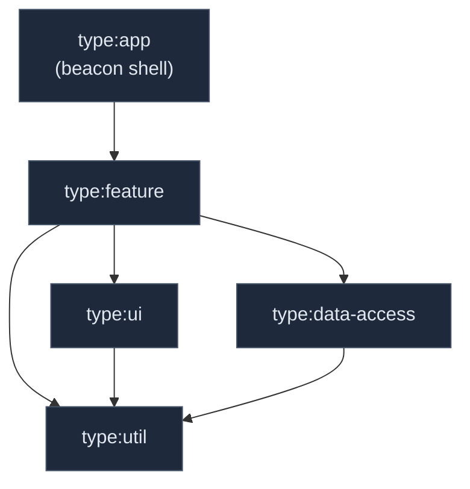

# Beacon — an Angular + Nx showcase

A small but deliberately-built **issue tracker**, used to showcase modern Angular
(21, **zoneless**, signals) inside a scalable **Nx 23** monorepo. The app is
intentionally modest in surface so that *every architectural decision is
explainable* — which is the point of the exercise.

**🔗 Live demo:** https://beacon-petromilpavlovs-projects.vercel.app
*(static SPA + serverless API; SSR and the live SSE feed run locally — see [Deployment](#deployment))*

> Built for the Push-Based technical interview. See
> [docs/WALKTHROUGH.md](docs/WALKTHROUGH.md) for the guided tour and Q&A map,
> and [docs/PERFORMANCE.md](docs/PERFORMANCE.md) for the Core Web Vitals story.

---

## Quick start

```sh
pnpm install

# Terminal 1 — the mock API (REST + SSE) on :3333
pnpm nx serve api          # or: node dist/apps/api/main.js after `nx build api`

# Terminal 2 — the Angular app (SSR) on :4200
pnpm nx serve beacon
```

Open http://localhost:4200 → Issues list, Board, Detail, Dashboard.

Everyday commands:

```sh
pnpm nx run-many -t lint test build   # everything
pnpm nx affected -t lint test build   # only what changed
pnpm nx graph                          # explore the project graph
pnpm nx g @beacon/plugin:feature --domain=issues --name=timeline   # scaffold a feature
```

---

## Architecture at a glance

A **domain × layer** library structure with **lint-enforced** boundaries.

```
apps/
  beacon        # thin SSR shell: routes, providers, layout
  api           # express mock API (REST + aggregates + SSE)
libs/
  issues/       feature-list · feature-detail · feature-board · data-access · ui
  dashboard/    feature · data-access
  shared/       ui (design system) · data-access (http/sse/settings) · util (model)
  plugin/       local Nx plugin (generator + executor + inference)
```

Two tag dimensions drive the rules (see [eslint.config.mjs](eslint.config.mjs)):

- **type:** `app → feature → ui / data-access → util` — a `ui` lib physically
  cannot import a store; lint fails in CI if it tries.
- **scope:** `issues`, `dashboard`, `shared`, `shell` — domains are isolated;
  cross-domain reuse only goes through `shared`.



Arrows are the *only* allowed dependencies. `ui → data-access` is absent by
design — and enforced. That single ruleset is the answer to *"how does this
scale to 100+ routes and 10 developers?"* — run `pnpm nx graph` to explore the
full project graph interactively.

| Boundary rule | Proven by |
|---|---|
| `ui` cannot depend on `data-access` | lint error on a probe import |
| `dashboard` cannot import `issues` | lint error on a probe import |

---

## Key decisions (the "why")

| Decision | Why |
|---|---|
| **Zoneless** change detection | No zone.js (~13 kB lighter); CD driven by signal reads + events → fewer long tasks, better INP |
| **NgRx SignalStore** for issues | Entity collection + derived selectors + optimistic writes shared across list/board/detail — what a store is *for* |
| **Plain-signals service** for dashboard & settings | Read-only derived state / two scalars — a store would be ceremony |
| **RxJS** only for typeahead + SSE | Debounce/cancellation and push-streams are RxJS's home turf; bridged to signals via `rxMethod`/`toSignal` |
| **SSR + incremental hydration** | Real LCP/INP story; `@defer (hydrate on viewport)` charts |
| **SCSS design tokens** (no Tailwind) | Semantic CSS custom properties → runtime theming as a data-attribute swap; `ui` libs stay framework-pure |
| **Angular 21, not 22** | `@nx/angular@23` + `@ngrx/signals@21` peer-cap at Angular 21; "latest" is a property of the whole dependency graph |

---

## Requirements coverage

How each requirement from the brief is addressed (the walkthrough maps each to a
file: [docs/WALKTHROUGH.md](docs/WALKTHROUGH.md)).

### 1. Component architecture, design patterns, scalability
| Requirement | Where |
|---|---|
| Maintainable, scalable structure | `domain × layer` libs; lint-enforced tag boundaries |
| Latest Angular + core concepts | Angular 21, standalone, zoneless, new control flow, `@defer` |
| Idiomatic DI | `inject()`, functional interceptors, `provideBeaconDataAccess()` |
| Idiomatic Pipes | `bcRelativeTime` pure pipe ([relative-time.pipe.ts](libs/shared/ui/src/lib/pipes/relative-time.pipe.ts)) |
| Idiomatic Directives | `bcTooltip` (Renderer2, host listeners — [tooltip.directive.ts](libs/shared/ui/src/lib/directives/tooltip.directive.ts)) |
| Idiomatic Routing | lazy `loadComponent`, `withComponentInputBinding()` |

### 2. Reactivity & state management
| Requirement | Where |
|---|---|
| Data flow & state | `IssuesStore` (SignalStore) normalizes streams → signals |
| RxJS knowledge | debounced/cancellable search + SSE (`debounceTime`/`switchMap`/`scan`) |
| Signal-based state | `signal`/`computed`/`effect`, SignalStore, plain-signals services |
| Justify Signals-vs-RxJS, Service-vs-Store | see decisions table above + walkthrough |

### 3. Performance & optimization — see [docs/PERFORMANCE.md](docs/PERFORMANCE.md)
| Requirement | Where |
|---|---|
| Change detection (explain) | **zoneless**; CD on signal change/events |
| Bundle size (lazy loading, deferrable views) | lazy routes + `@defer` charts |
| Rendering (layout thrash, efficient DOM) | CDK virtual scroll, `@for; track`, transform-based drag |
| INP / CLS / LCP (cause, analyze, improve) | cause→fix table + `web-vitals` instrumentation; CLS structurally 0 (sized defer placeholders) |

### 4. Nx — see [docs/WALKTHROUGH.md](docs/WALKTHROUGH.md#nx)
| Requirement | Where |
|---|---|
| Scalable library structure, code reuse, boundaries | `feature/ui/data-access/util` × scope; `@nx/enforce-module-boundaries` |
| DX automation (custom executors, task inference) | local plugin: generator + **executor** + **inference** ([libs/plugin](libs/plugin)) |
| Performance & CI/CD, **Nx Cloud** | `nx affected` CI; Nx Cloud remote cache + distribution |
| Caching: how it works, pitfalls, tuning | `nx.json` named inputs; pitfalls in the walkthrough |

---

## Deployment

Deployed to Vercel as a **static SPA + a serverless function for the API**
(same origin). See [vercel.json](vercel.json) and [api/index.ts](api/index.ts).

Because Vercel functions are serverless, the live demo differs from local in
three ways (all work fully when run locally with `nx serve`):

- **CSR, not SSR** — no persistent Node server to host the SSR renderer.
- **The live SSE feed doesn't tick** — functions can't hold long-lived connections.
- **Writes don't persist** across requests — the API is stateless in-memory.

The base API URL is environment-driven (`localhost:3333` in dev, relative
same-origin in prod) via `fileReplacements`.

---

## Stack

Angular 21.2 (zoneless, SSR) · Nx 23.0.1 · NgRx Signals 21 · Angular CDK 21 ·
TypeScript 5.9 · Vitest · Playwright · express · pnpm.
